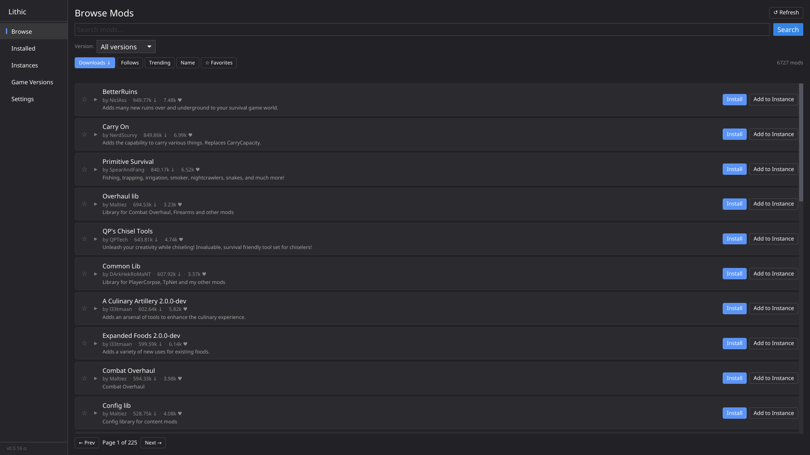

# Lithic

A fast, cross-platform mod manager for Vintage Story with both CLI and GUI
workflows. Browse, install, update, enable, disable, and organize your mods
without juggling folders by hand, whether you prefer scripting everything from
the terminal or managing your setup through a simple desktop interface.

<!--markdownlint-disable MD033-->

<p align="center">
  
</p>

<!--markdownlint-enable MD033-->

## Installation

There are two ways to install Lithic on your system.

### With Nix

Nix is the recommended way of downloading (and developing!) Lithic. You can
install it using Nix flakes using `nix profile add` if on non-nixos or add
Lithic as a flake input if you are on NixOS or Darwin.

```nix
{
  # Add Lithic to your inputs like so
  inputs.lithic.url = "github:NotAShelf/lithic";

  outputs = { /* ... */ };
}
```

Then you can get the package from your flake input, and add it to your packages
to make `lithic` available in your system.

```nix
{inputs, pkgs, ...}: let
  lithicPkg = inputs.lithic.packages.${pkgs.stdenv.hostPlatform.system}.lithic;
in {
  environment.systemPackages = [lithicPkg];
}
```

If you want to give Lithic a try before you switch to it, you may also run it
one time with `nix run`.

```sh
# Run directly from the git repository; will be garbage collected
$ nix run github:NotAShelf/lithic # start the watch daemon
```

### Without Nix

[GitHub Releases]: https://github.com/notashelf/lithic/releases

You can also install Lithic on any of your systems _without_ using Nix. New
releases are made when a version gets tagged, and are available under
[GitHub Releases]. To install Lithic on your system without Nix, either:

- Download a tagged release from [GitHub Releases] for your platform and place
  the binary in your `$PATH`. Instructions may differ based on your distribution
  and operating system, but generally you want to download the built binary from
  releases and put it somewhere like `/usr/bin` or `~/.local/bin` depending on
  your distribution.
- Build and install from source with Cargo:

  ```bash
  cargo install lithic-cli --locked
  cargo install lithic-gui --locked
  ```

Additionally, you may get Lithic from source via `cargo install` using
`cargo install --git https://github.com/notashelf/lithic --locked -p lithic-cli`
or you may check out to the repository, and use Cargo to build it before
`install`ing the files to a directory part of your `PATH`. You'll need Rust
1.91.0 or above. Most distributions should package this version already. You
may, of course, prefer to package the built releases if you'd like.

## CLI Usage

> [!TIP]
> You can also use `lithic-gui` from the command line to launch the graphical
> interface.

<!--markdownlint-disable MD013-->

```text
An extremely fast mod manager for Vintage Story, written in Rust.

Usage: lithic-cli [OPTIONS] <COMMAND>

Commands:
  sync          Checks with the VintageStory mods website for any updates to mods you have installed. Run update after this command to update your mods
  list          List installed mods and their versions and any missing dependencies. Running sync first will show any available updates to your mods
  update        Updates a specific mod OR all mods installed. Runs sync after completion
  install       Install a specific mod. Must use the mod_id, Example: ./Lithic install alchemy
  search        Search the mod website for new mods, Example: ./Lithic search -q magic
  config        Manage config options for Lithic
  misc          Miscellaneous items for Lithic, like shell auto-completion and 1-click mod installation
  download      Download a Vintage Story executable
  info          Get more information about the mod specified
  modpack       Create, download, update modpacks for VintageStory
  self          Manage the Lithic binary; Check for updates, perform updates.
  delete        Remove mods and backups
  instance      Manage game instances
  game-version  Manage installed game versions
  launch        Launch Vintage Story using the selected instance
  help          Print this message or the help of the given subcommand(s)

Options:
  -v, --verbose
  -d, --debug                Shows all logging messages. This is EXTREMELY noisy. Only run this if you have to
  -m, --mods-dir <MODS_DIR>  Specify the directory to manage mods. This takes priority over any other directory setting, including from the config file
  -w, --with-mpk <WITH_MPK>  This command will set the working mod directory to be that of the modpack specified, INCLUDING modpacks you create. If you use this to work on a custom m
odpack, you will need to run Lithic modpack create again to update your modpack file, just set the --mpk-id to the same one you used before to overwrite the old one
  -h, --help                 Print help
  -V, --version              Print version
```

<!--markdownlint-enable MD013-->

### Common workflows

```bash
# Sync your mod list with the mod database
$ lithic-cli sync

# List installed mods
$ lithic-cli list

# Search for mods
$ lithic-cli search -q magic

# Install a mod
$ lithic-cli install alchemy

# Update all mods
$ lithic-cli update

# Get info about a mod
$ lithic-cli info alchemy

# Launch the game
$ lithic-cli launch

# Generate shell completions
$ lithic-cli misc --gen-auto-complete bash
```

## GUI Usage

Launch the graphical interface from your application menu or terminal:

```bash
lithic-gui
```

The GUI provides a point-and-click interface for:

- **Browse** – Search and discover mods from the Vintage Story mod database.
- **Manage** – Enable, disable, and remove installed mods.
- **Update** – See which mods have updates available and apply them.
- **Modpacks** – Create and manage modpack collections.
- **Instances** – Switch between different game instances and configurations.

## License

[@Tekunogosu/rustique]: https://github.com/Tekunogosu/rustique

This project is derived from [@Tekunogosu/rustique], originally licensed under
the MIT License. Original copyright and MIT license text are preserved in
`LICENSES/MIT.txt`. Modifications and new project code are distributed under the
Mozilla Public License (MPL) version 2.0. See [LICENSE](LICENSE) for more
details on the exact conditions. An online copy is
[provided here](https://www.mozilla.org/en-US/MPL/2.0/).
